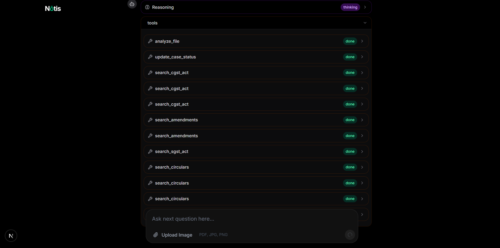
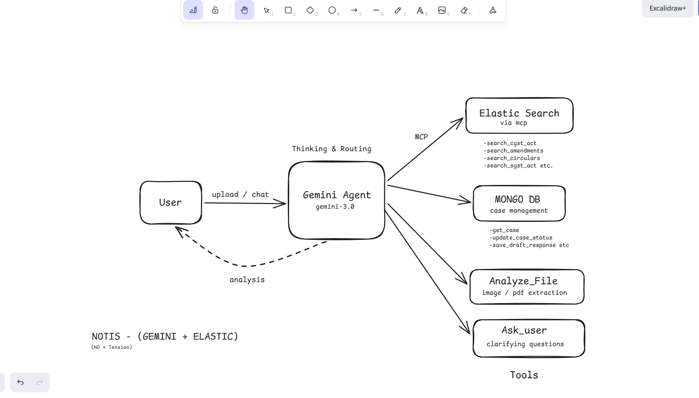

# Nōtis — AI GST Compliance Agent

> **60 million small businesses in India receive GST notices every year. Nōtis gives them a CA in their pocket, for free.**

**🚀 [Try Nōtis Live](https://notis-agent.vercel.app/)** | **📹 [Watch Demo](https://youtu.be/46WcDlWhIeE)**


---

## 📌 The Problem

India has over 60 million GST-registered small businesses. Every one of them receives notices — show cause notices, demand notices, ITC mismatch notices — and most owners have no idea what to do.

Their options:

- Pay a CA ₹5,000–₹10,000 (USD 50–100) **per notice** to draft a reply
- Ignore the notice and face automatic penalties

GST law is not simple. It has:

- **Central GST Act (CGST)** — 174 sections of base law
- **Finance Act amendments** — 2023 and 2026 changed key sections on ITC, penalties, and assessments
- **State GST Acts (SGST)** — each of India's 28 states has its own act with additional provisions
- **CBIC Circulars** — new practical guidance issued regularly that overrides how sections are enforced

A simple AI wrapper won't work — it will hallucinate legal citations, miss amendments, and ignore state-specific rules. A wrong citation in a response letter costs real money.

---

## 💡 What Nōtis Does

Upload a GST notice (image or PDF) or describe your situation in plain language. Nōtis:

1. **Reads the notice** — extracts notice type, ARN number, GSTIN, demand amount, due date, sections cited
2. **Searches real legal sources** — CGST Act 2017, Finance Act 2023 & 2026 amendments, CBIC circulars, state SGST acts
3. **Drafts a ready-to-send response letter** — with proper legal citations, correct section references, documents to attach
4. **Finds savings opportunities** — unclaimed ITC, penalty reductions, incorrect demand amounts, deadline extensions
5. **Explains everything in plain language** — so the business owner understands what happened and what to do




---

## 🎬 Demo & Deployment

- **Live Demo**: https://notis-agent.vercel.app/
- **Video Demo**: https://youtu.be/46WcDlWhIeE (3-5 min walkthrough)

---

## 🏗️ Architecture



```
User (notice upload / chat)
        │
        ▼
  Gemini 3.1 Pro Agent  ──── MCP ────▶  Elasticsearch
  (ADK + thinking)                       ├── search_cgst_act
        │                                ├── search_amendments
        │                                ├── search_circulars
        ├──────────────────────▶         └── search_sgst_act
        │                             MongoDB
        │                                ├── get_case
        │                                ├── update_case_status
        │                                └── save_draft_response
        ├──────────────────────▶  Analyze File
        │                         (image/PDF extraction via Gemini)
        └──────────────────────▶  Ask User
                                  (clarifying questions)
```

### Tech Stack

| Layer         | Technology                                                     |
| ------------- | -------------------------------------------------------------- |
| AI Agent      | Gemini 3.1 Pro via Google Cloud Agent Builder (Google ADK)     |
| Search        | Elasticsearch (Elastic Cloud)                                  |
| Agent Tools   | Elastic MCP Server + Google ADK native MCP tool support        |
| Database      | MongoDB Atlas                                                  |
| Backend       | Express, TypeScript, Bun                                       |
| Frontend      | Next.js, Tailwind CSS                                          |
| Streaming     | Server-Sent Events (SSE)                                       |

---

## 🔍 Why Elasticsearch (and how we used it)

The easy path is one index, dump all PDFs in, run a semantic search. That produces generic results.

Indian GST law is **layered** — a base act, amendments that override specific sections, state acts that add provisions on top, and circulars that change how sections are enforced in practice. A single index flattens this hierarchy and loses it.

We built **7 separate indices**, each scoped to one layer of the law:

- `gst-cgst-2017` — base act, so the agent always searches foundation law first
- `gst-amendments-2023` / `gst-amendments-2026` — isolated so the agent can explicitly check "did this section change?"
- `gst-sgst-mh/ka/dl` — state-specific, searched only when the GSTIN matches that state
- `gst-circulars` — enforcement guidance, always searched last since circulars clarify, not define

Each document was parsed with a **Gemini-powered pipeline** that extracts structured metadata — section number, chapter, notice types, keywords, category — before indexing. This means queries return the right section, not just the right paragraph.

Every answer must be grounded in retrieved documents — not AI memory. A wrong legal citation costs real money.

**ADK's native MCP tool support** made this possible without building a custom RAG pipeline.
The agent calls `search_cgst_act`, `search_amendments`, `search_circulars`, and
`search_sgst_act` as natural tool calls during reasoning. Elasticsearch handles the
retrieval; Gemini handles the legal reasoning.

---

## 📚 Legal Knowledge Base

Documents indexed into Elasticsearch across 7 indices:

| Index                 | Content                          |
| --------------------- | -------------------------------- |
| `gst-cgst-2017`       | CGST Act 2017 — all 174 sections |
| `gst-amendments-2023` | Finance Act 2023 amendments      |
| `gst-amendments-2026` | Finance Act 2026 amendments      |
| `gst-circulars`       | CBIC Circulars 187 & 188 (2022)  |
| `gst-sgst-mh`         | Maharashtra SGST Act             |
| `gst-sgst-ka`         | Karnataka SGST Act               |
| `gst-sgst-dl`         | Delhi SGST Act                   |

All PDFs were parsed using a Gemini-powered pipeline that extracts sections with structured
metadata — section number, chapter, notice types, keywords, category — before indexing.

---

## 🤖 Mandatory Research Protocol

Before answering any query, the agent follows this exact sequence:

```
1. analyze_file      → extract notice details from uploaded document
2. search_cgst_act   → find base law sections
3. search_amendments → check if sections were updated in 2023 or 2026
4. search_sgst_act   → check state-specific provisions (if GSTIN state is MH/KA/DL)
5. search_circulars  → find practical enforcement guidance
6. synthesize        → compile findings and respond with citations
```

Every response includes:

- **Sources checked** — exactly which section and circular was found
- **Savings opportunities** — ITC, penalty reduction, deadline extensions
- **Action items** — what to do and by when
- **Draft response letter** — ready to send with legal citations
- **Plain English summary** — no jargon

---

## 🚀 Getting Started

### Prerequisites

- Bun or Node.js 18+
- MongoDB Atlas account
- Elastic Cloud account
- Google AI API key (Gemini 3.1 Pro)

### Environment Variables

**Backend `.env`:**

```env
MONGODB_URI=your_mongodb_connection_string
ELASTIC_URL=https://your-cluster.es.elastic-cloud.com
ELASTIC_API_KEY=your_elastic_api_key
KIBANA_URL=https://your-cluster.kb.elastic-cloud.com
GEMINI_API_KEY=your_gemini_api_key
GEMINI_MODEL=gemini-3.1-pro-preview
PORT=3001
```

**Frontend `.env.local`:**

```env
NEXT_PUBLIC_BACKEND_URL=http://localhost:3001
```

### Installation

```bash
# Clone the repo
git clone https://github.com/rushibhosalepro/notis-agent
cd notis-agent

# Install backend dependencies
cd backend
bun install

# Install frontend dependencies
cd ../frontend
bun install
```

### Run Locally

```bash
# Backend
cd backend
bun run dev

# Frontend (separate terminal)
cd frontend
bun run dev
```

### Index Legal Documents

```bash
cd backend
# Add your PDF files to backend/data/
# Run the parser
bun run data/parse.ts
```

---

## 📁 Project Structure

```
notis-agent/
├── backend/
│   ├── src/
│   │   ├── server.ts             # Express server entry point
│   │   ├── types.ts              # Shared TypeScript types
│   │   ├── agent/
│   │   │   ├── notisAgent.ts     # ADK LlmAgent factory (per-request)
│   │   │   ├── runAgent.ts       # ADK runner + SSE streaming
│   │   │   ├── runner.ts         # Agent runner utility
│   │   │   ├── customTools.ts    # Custom tool definitions
│   │   │   └── prompt.ts         # System prompt
│   │   └── utils/
│   │       ├── mcp.ts            # Elasticsearch MCP client
│   │       ├── sse.ts            # Server-Sent Events helpers
│   │       ├── generateId.ts     # ID generation utility
│   │       └── database/
│   │           ├── mongodb.ts    # MongoDB connection
│   │           └── functions.ts  # MongoDB tool functions
│   ├── data/
│   │   ├── parse.ts              # PDF parsing + indexing pipeline
│   │   ├── json/                 # Pre-parsed legal document JSON
│   │   │   ├── cgst_2017-parsed.json
│   │   │   ├── circular-parsed.json
│   │   │   ├── finance_act_2026-parsed.json
│   │   │   ├── sgst_dl-parsed.json
│   │   │   ├── sgst_ka-parsed.json
│   │   │   └── sgst_mh-parsed.json
│   │   └── pdfs/                 # Source GST legal documents
│   │       ├── cgst-act-2017.pdf
│   │       ├── finance-act-2023.pdf
│   │       ├── finance-act-2026.pdf
│   │       ├── circular-187-19-2022-GST.pdf
│   │       ├── circular-188-20-2022-GST.pdf
│   │       ├── sgst-mh.pdf
│   │       ├── sgst-ka.pdf
│   │       └── sgst-dl.pdf
│   ├── dist/                     # Compiled output
│   └── tmp/uploads/              # Temporary file uploads
└── frontend/
    └── src/
        ├── types.ts              # Shared TypeScript types
        ├── app/
        │   ├── layout.tsx        # Root layout
        │   ├── page.tsx          # Home page
        │   ├── globals.css
        │   └── (pages)/
        │       └── case/[caseId]/
        │           └── page.tsx  # Chat page
        ├── components/
        │   ├── ChatPage.tsx      # Chat interface
        │   ├── ChatBox.tsx       # Message renderer
        │   └── ui/               # Shadcn UI components
        │       ├── button.tsx
        │       ├── card.tsx
        │       └── textarea.tsx
        ├── lib/
        │   └── utils.ts          # Utility functions
        └── stores/
            └── useCaseStore.ts   # Zustand global store
```

---

## 🔮 What's Next

- **GSTIN-based automatic context fetch** — pull actual filing history (GSTR-1, GSTR-3B, GSTR-2A) directly from the GST portal using the user's GSTIN, so the agent already knows their tax position before they ask
- **Pre-emptive return health check** — analyze current returns to catch ITC mismatches and filing errors before the department does
- **All 28 state SGST acts** — currently supporting Maharashtra, Karnataka, and Delhi
- **Vernacular language support** — Hindi and regional languages for small business owners
- **Deadline tracking with reminders** — automatic alerts before notice response deadlines
- **GSTR return file analysis** — upload a return file and get a full audit before filing

---

## 🧠 What We Learned

- **ADK's MCP tool support is production-ready** — connecting `MCPToolset` to Elastic's Kibana MCP endpoint required zero custom RAG code; the agent calls search tools as natural function calls during reasoning.
- **Legal grounding is harder than it looks** — a plain LLM hallucinates sections and dates. Grounding every answer in Elasticsearch-retrieved documents eliminated that class of error entirely.
- **SSE streaming with ADK needs care** — ADK emits intermediate thinking events and tool call events mixed with final text; writing the event filter to surface only what the user needs took real iteration.
- **Small businesses need plain language first** — the response format evolved through testing to put the "Plain English Summary" last in the prompt template; users skipped the legal citations and went straight to the summary every time.
- **Parsing Indian legal PDFs is a project in itself** — CGST Act, state SGSTs, and CBIC circulars each had different PDF structures and section numbering schemes; a Gemini-powered parsing pipeline was necessary to build a clean index.

---

## 📄 License

MIT License — see [LICENSE](./LICENSE)

---

## 🏆 Built for

[Google Cloud Rapid Agent Hackathon](https://rapid-agent.devpost.com/) — Elastic Partner Track

Built with ❤️ to help Indian small businesses fight back against GST notices.
